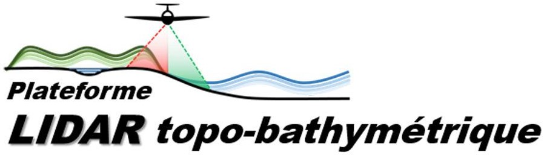

**lidar_platform** is a library in Python to process point clouds coded by the LiDAR platform members.

API documentation and tutorials are available at [ReadTheDocs](https://lidar-platform.readthedocs.io).
